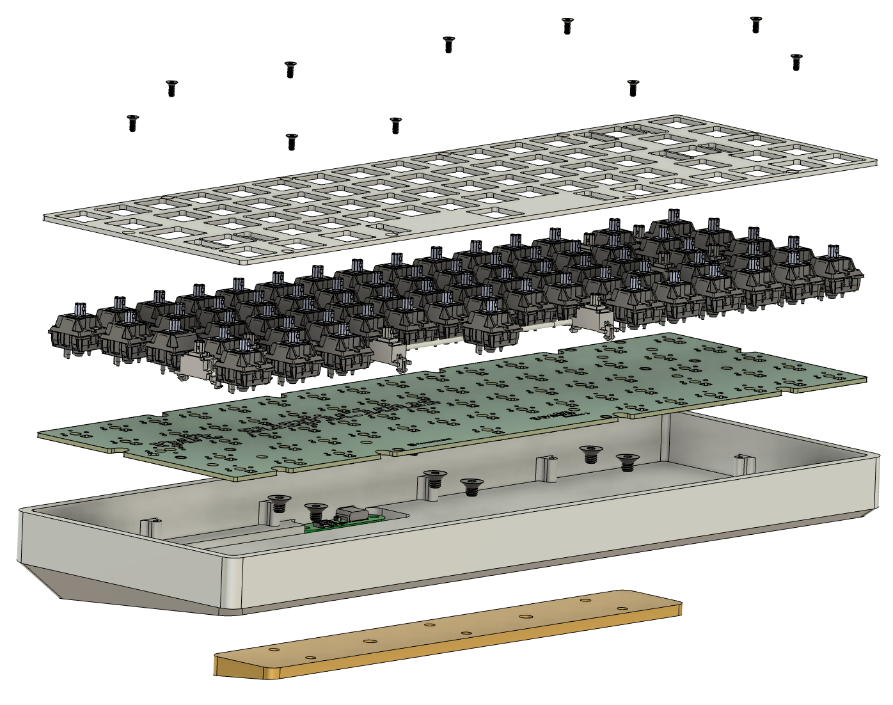
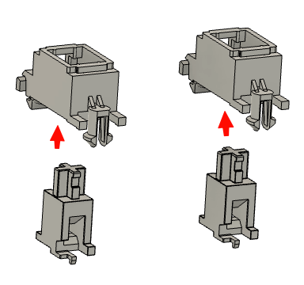
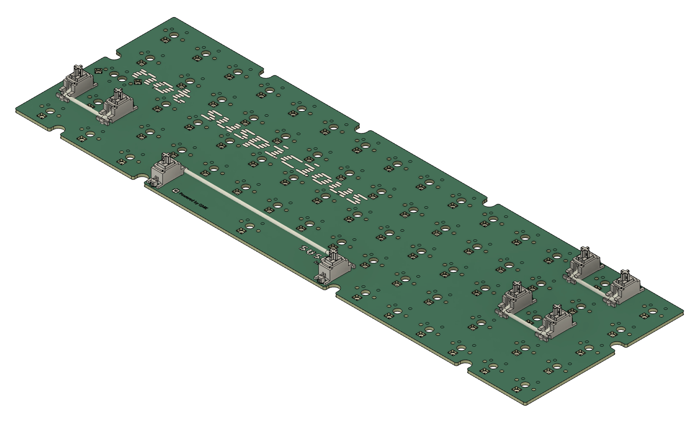
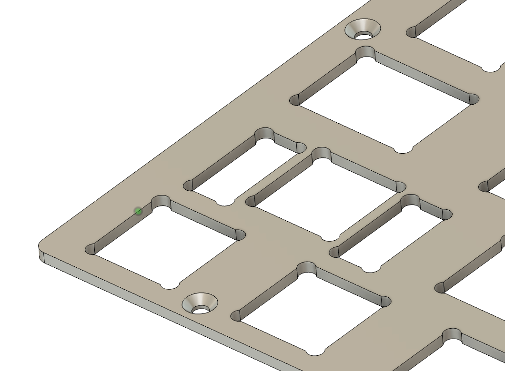
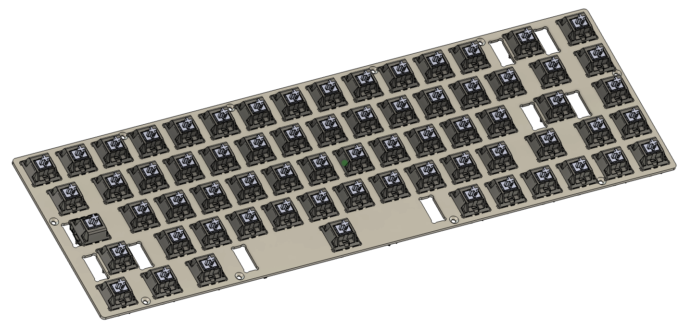
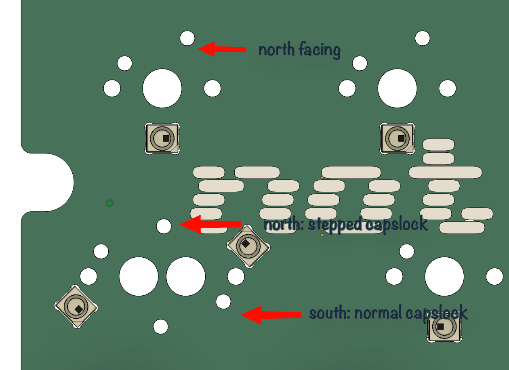
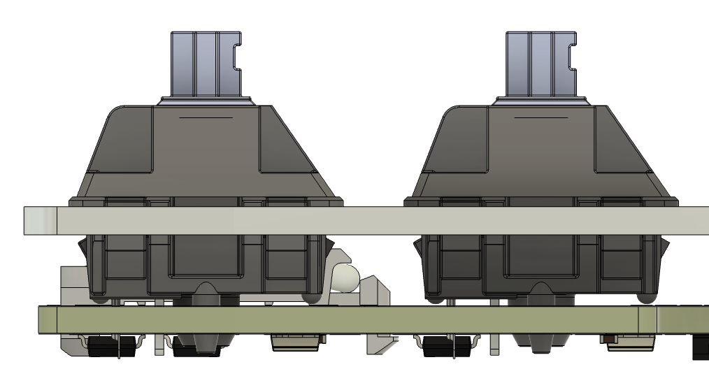
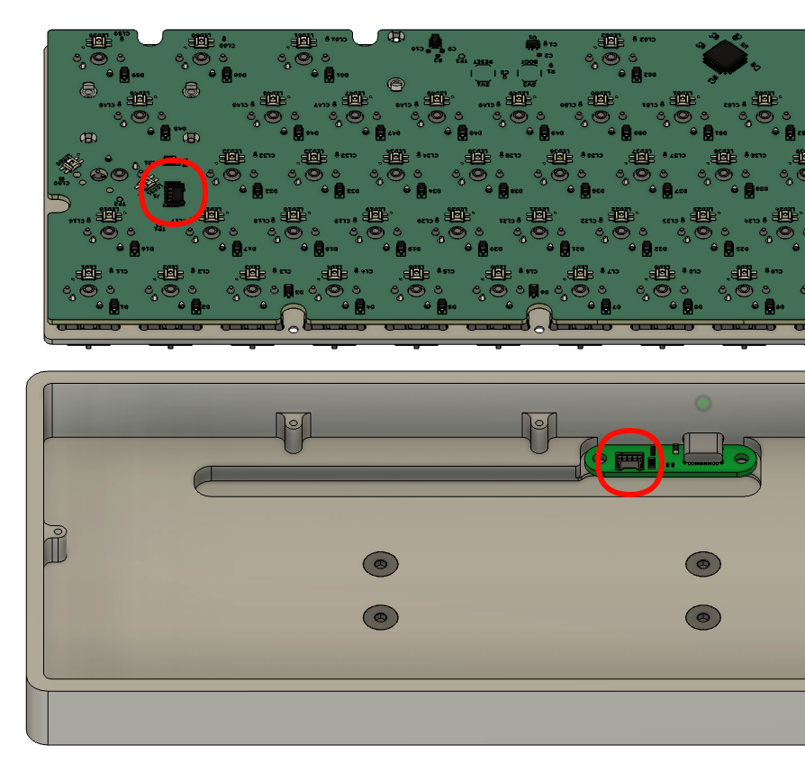
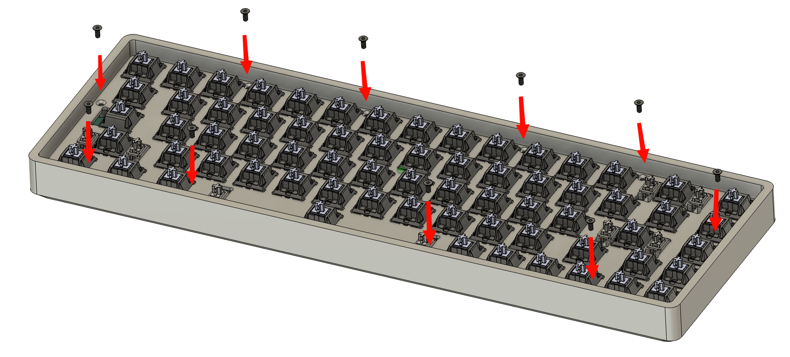

# SUS Build Guide

This is a general build guide for the lineup of SUS keyboards:

* SUS60
* SUS65
* SUS75
* SUSTKL
* FullSUS

First ensure you have all of the items that comes with the kit. If you are missing any of the compoonents, please reach out our support.

* PCB
* Plate
* USB-C daughterboard pre-installed in case
* Molex Pico-EZmate cable pre-connected to daughterboard
* M2x5mm countersunk screws*
* 1.3mm hex wrench (usually in with keycap puller and brush)

!!! Note
    For SUS75, SUSTKL, and FullSUS keyboards the plate will typically be premounted in the case with the necessary M2x5mm screws. With the risen areas on the plates, it is more compact to mount them than to have them separate.

The items you will need to provide include (all must be MX compatible):

* Switches
* Stabilizers
* Keycaps

A list of tools you could potentially need include:

* Soldering iron
* Tweezers (useful for testing the board and handling screws)

## Verify the PCB

The PCB will be pre-flashed with our latest QMK firmware and is tested before packaging, however it can be a good idea to verify nothing was damaged during shipping, and to catch it early before any soldering begins. With the PCB out of the case, connect the Molex cable to the PCB and plug the USB cable into the case. The LEDs on the PCB should light up and your computer should register a new keyboard being connected. You can use a pair of tweezers to gently test a pair of switch posts.

## Prepare the PCB

1. Prepare all of the stems and housings for your stabilizers. If you're newer to building keyboards, a [video guide](https://www.youtube.com/watch?v=usNx1_d0HbQ) on stabilizers would be useful to be familiar yourself.

1. Mount the housings onto the PCB. Note that the top of the PCB will have a circle around the hole intended for the clip side.

1. Ensure all the bars are mounted and working with the stems before proceeding.

## Prepare the Plate

1. Ensure the plate is oriented correctly before you begin. Ensure the countersunk portion of the screw hole is facing up.

1. Begin placing switches into the plate. You can either populate all of the switches and then align them with the PCB, or at a minimum populate a couple of switches in each corner of the plate before mating to the PCB.

1. Note that *almost* all switches should be oriented with the pins at the top or north position. Review the PCB if alternate layouts have switches rotated. Notably:
    1. Caps Lock in the standard position should have south facing pins. A stepped Caps Lock uses north facing pins.

## Combining the Plate and PCB

1. Lay the plate on top of the PCB and ensure the posts go into all of the switc holes. Be careful not to push or force any, if they don't slide right in, it may be necessary to fix a bent connector or verify the switch orientation.
1. Once they're all inserted, ensure the switches fully seat into the PCB.

1. Typically recommend to solder the switches near the corners first to ensure no movement of the plate.
1. If you opted not to fully populate the plate with switches, ensure you install all of the switches now.
1. Solder away with some good music, podcast, or something to help pass the time.

## Mounting the Plate

1. Place the plate and PCB flipped horizontally just above the case. With this, the Molex connector is closest to the daughterboard and on the same side it will be on when installed.
1. Connect the Molex connector to the PCB and ensure it is fully seated on both sides of the connection.

1. Flip the plate over and lay it into the case.
1. Before proceeding, it is highly recommended to connect the keyboard to your PCB and ensure all of the switches work. Use QMK Toolbox and its keytester utility to test each of the switches. If any are not working, it is easier to full the PCB out and check the solder before the plate is mounted and keycaps are installed.
1. Once verified, use the M2x5mm screws to secure the plate to the case.

1. Place all of your keycaps